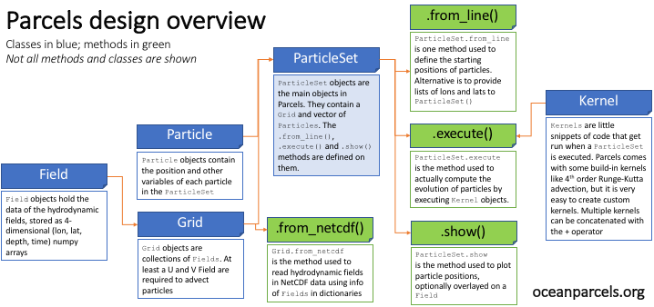
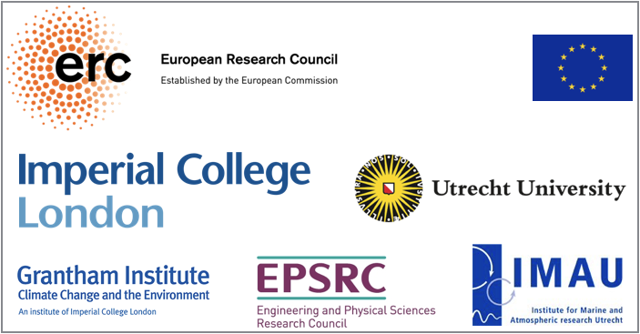

.. parcels documentation master file, created by
   sphinx-quickstart on Tue Oct 20 09:58:20 2015.
   You can adapt this file completely to your liking, but it should at least
   contain the root `toctree` directive.

Welcome to Parcels
===================================

**Parcels** (**P**\ robably **A** **R**\ eally **C**\ omputationally **E**\ fficient **L**\ agrangian **S**\ imulator) is an experimental prototype code aimed at exploring novel approaches for Lagrangian tracking of virtual ocean particles in the petascale age. 

Its code is licensed under an `open source MIT license <https://github.com/OceanParcels/parcels/blob/master/LICENSE.md>`_ and can be downloaded from https://github.com/OceanParcels/parcels.

.. figure:: http://oceanparcels.org/animated-gifs/globcurrent_fullyseeded.gif
   :align: center
   
   *Animation of virtual particles carried by ocean surface flow in the* `Agulhas Current <https://en.wikipedia.org/wiki/Agulhas_Current>`_ *off South Africa. The particles are advected with* `Parcels <http://oceanparcels.org/>`_ *in data from the* `GlobCurrent Project <http://globcurrent.ifremer.fr/products-data/products-overview>`_. *See* `this tutorial <http://nbviewer.jupyter.org/github/OceanParcels/parcels/blob/master/examples/tutorial_Agulhasparticles.ipynb>`_ *for the Parcels code behind this animated gif.*

Parcels v0.9 manuscript and code
===================================
The manuscript detailing this first release of Parcels, version 0.9, is currently under discussion at `Geoscientific Model Development <https://doi.org/10.5194/gmd-2017-167>`_ and can be cited as 

*Lange, M. and van Sebille, E.: Parcels v0.9: prototyping a Lagrangian Ocean Analysis framework for the petascale age, Geosci. Model Dev. Discuss., https://doi.org/10.5194/gmd-2017-167, in review, 2017.*

The code is available at https://github.com/OceanParcels/parcels. Anyone is welcome to comment on the manuscript through the Geoscientific Model Development portal.

Parcels development status
===================================

The current release of Parcels, version 0.9, is a fully-functional, feature-complete code for offline Lagrangian ocean analysis. See below for a list of features, or keep an eye 
on the `Github Development Timeline page
<https://github.com/OceanParcels/parcels/projects/1>`_

**Currently implemented in v0.9**

* Advection of particles in 2D using inbuilt kernels for Runge-Kutta4, Runge-Kutta45 and Euler Forward and in 3D using the inbuilt kernel for Runge-Kutta4_3D (see :mod:`parcels.kernels.advection`)
* Ability to define and execute custom kernels (see `the Adding-a-custom-behaviour-kernel part of the Tutorial <http://nbviewer.jupyter.org/github/OceanParcels/parcels/blob/master/examples/parcels_tutorial.ipynb#Adding-a-custom-behaviour-kernel>`_)
* Ability to add custom Variables to Particles (see `the Sampling-a-Field-with-Particles part of the Tutorial <http://nbviewer.jupyter.org/github/OceanParcels/parcels/blob/master/examples/parcels_tutorial.ipynb#Sampling-a-Field-with-Particles>`_)
* Ability to add and remove Particles (see :func:`parcels.particleset.ParticleSet.add` and :func:`parcels.particleset.ParticleSet.remove`)
* Ability to run in both Scipy and JIT (Just-In-Time compilation) mode. The former is easier to debug, but the latter can be a factor 1,000 faster (see the `JIT-vs-Scipy tutorial <http://nbviewer.jupyter.org/github/OceanParcels/parcels/blob/master/examples/tutorial_jit_vs_scipy.ipynb>`_)
* Ability to read in any type of hydrodynamic field in NetCDF format, as long as the grid is rectangular (i.e. grid axes are aligned with longitude and latitude; see :mod:`parcels.fieldset.FieldSet.from_netcdf` and `the Reading-in-data-from-arbritrary-NetCDF-files part of the Tutorial <http://nbviewer.jupyter.org/github/OceanParcels/parcels/blob/master/examples/parcels_tutorial.ipynb#Reading-in-data-from-arbritrary-NetCDF-files>`_)
* Output particles in NetCDF format (see :mod:`parcels.particlefile`)
* Basic plotting of particles, both on the fly and from netcdf output files (see the `plotting tutorial <http://nbviewer.jupyter.org/github/OceanParcels/parcels/blob/master/examples/tutorial_plotting.ipynb>`_)

**Major developed goals beyond v0.9**

* Diffusion of particles using suite of inbuilt kernels
* Support for non-rectangular grids, including unstructured meshes
* Implementation of parallel execution using tiling of the domain
* Faster and more efficient code
* Advanced control of particles near land boundaries

Parcels Tutorials 
===================================

The best way to get started with Parcels is to have a look at the Jupyter notebooks below:

* `Parcels tutorial <http://nbviewer.jupyter.org/github/OceanParcels/parcels/blob/master/examples/parcels_tutorial.ipynb>`_ for a general introduction and overview into the main features of Parcels

* `Periodic boundaries tutorial <https://nbviewer.jupyter.org/github/OceanParcels/parcels/blob/master/examples/tutorial_periodic_boundaries.ipynb>`_ for a tutorial on how to implement periodic boundary conditions

* `FieldSet.advancetime() tutorial <https://nbviewer.jupyter.org/github/OceanParcels/parcels/blob/master/examples/tutorial_advancetime.ipynb>`_ for a tutorial on how to use Parcels with datasets that have a large number of time snapshots.

* `Delayed start of particles tutorial <http://nbviewer.jupyter.org/github/OceanParcels/parcels/blob/master/examples/tutorial_delaystart.ipynb>`_ for a tutorial on how to add particles to a ParticleSet during runtime, so that not all particles are released on the start of the run.

* `JIT-vs-Scipy tutorial <http://nbviewer.jupyter.org/github/OceanParcels/parcels/blob/master/examples/tutorial_jit_vs_scipy.ipynb>`_ for a tutorial showing how JIT  and Scipy mode compare.

* `Animated Gif tutorial <http://nbviewer.jupyter.org/github/OceanParcels/parcels/blob/master/examples/tutorial_Agulhasparticles.ipynb>`_ for a  tutorial on how to created the Agulhas region animated gif on the top of this page. This tutorial also features a brief explanation of how to handle `OutOfBounds` errors.

* `Plotting tutorial <http://nbviewer.jupyter.org/github/OceanParcels/parcels/blob/master/examples/tutorial_plotting.ipynb>`_ for further explanation on the plotting capabilities of Parcels

Installing Parcels on Linux and macOS
=====================================

Parcels depends on a working Python installation, a netCDF installation, a C
compiler, and various Python packages. 

The simplest way to install Parcels is to use Anaconda and Conda-Forge for all 
requirements. This is the “batteries-included” solution probably suitable for most users.

1. Install Anaconda's Miniconda following the steps at https://conda.io/docs/user-guide/install/. All the code below assumes that you download the Python-2 version.

2. Download Parcels' `environment.yml <https://raw.githubusercontent.com/OceanParcels/parcels/master/environment.yml>`_ file and run::

    source $HOME/miniconda2/bin/activate root
    conda env create -f environment.yml -n py2_parcels
    source $HOME/miniconda2/bin/activate py2_parcels
    pip install git+https://github.com/OceanParcels/parcels.git@master

3. Validate the installation by downloading the `example_peninsula.py <https://raw.githubusercontent.com/OceanParcels/parcels/master/examples/example_peninsula.py>`_ file and then run::

    python example_peninsula.py --fieldset 100 100

4. Optionally, if you want to run all the examples and tutorials, you may want to download the example hydrodynamic fields by downloading the `pull_data.py <https://raw.githubusercontent.com/OceanParcels/parcels/master/parcels/scripts/pull_data.py>`_ file and then run::

    python pull_data.py

5. The next time you log in to your machine and want to work with Parcels, activate the environment with::

    source $HOME/miniconda2/bin/activate py2_parcels

An alternative, more advanced option is to use an existing netCDF installation and 
C compiler, ``git clone`` the `master branch of Parcels 
<https://github.com/OceanParcels/parcels>`_ 
and ``pip install`` the dependencies in the `environment.yml <https://raw.githubusercontent.com/OceanParcels/parcels/master/environment.yml>`_ file.

Windows specific pre-installation instructions
----------------------------------------------

Before following the general installation instructions listed under the header **Installing Parcels on Linux and macOS**, the user needs to install a gcc compiler on the Windows system. It is advised for the Windows user to install the `MinGW <http://www.mingw.org>`_ software suite. Do note that installing MinGW is usually not enough for Parcels to access it, most likely the Windows ``PATH`` must be updated to point to the MinGW\bin directory for Parcels to be able to access gcc.

If you do not know how to change the ``PATH`` variable on Windows, you can follow this `tutorial <https://www.computerhope.com/issues/ch000549.htm>`_. 

Getting involved
===================================

Parcels development is supported by Utrecht University and Imperial College London, with contributions 
from the people listed on the `Contributors page 
<https://github.com/OceanParcels/parcels/graphs/contributors>`_. 

If you want to help out with developing, testing or get involved in another way, 
please join the `mailing list 
<https://mailman.ic.ac.uk/mailman/listinfo/oceanparcels>`_.

Python design overview
===================================

   
   *The figure above gives a brief overview of how the most important classes and methods in Parcels are related.*

See below for links to the full documentation of the python code for Parcels

Writing Parcels Kernels
===================================

One of the most powerful features of Parcels is the ability to write custom Kernels (see e.g. `the Adding-a-custom-behaviour-kernel part of the Tutorial <http://nbviewer.jupyter.org/github/OceanParcels/parcels/blob/master/examples/parcels_tutorial.ipynb#Adding-a-custom-behaviour-kernel>`_). These Kernels are little snippets of code that get executed by Parcels, giving the ability to add 'behaviour' to particles. 

However, there are some key limitations to the Kernels that everyone who wants to write their own should be aware of:

* Every Kernel must be a function with the following (and only those) arguments: ``(particle, fieldset, time, dt)``

* In order to run successfully in JIT mode, Kernel definitions can only contain the following types of commands:

  * Basic arithmetical operators (``+``, ``-``, ``*``, ``/``) and assignments (``=``).

  * Basic logical operators (``<``, ``==``, ``>``, ``&``, ``|``)

  * ``if`` and ``while`` loops, as well as ``break`` statements. Note that ``for``-loops are not supported in JIT mode
    
  * Interpolation of a ``Field`` from the ``fieldset`` at a (time, lon, lat, depth) point, using using square brackets notation. For example, to interpolate the zonal velocity (`U`) field at the particle location, use the following statement::

      value = fieldset.U[time, particle.lon, particle.lat, particle.depth]

  * Functions from the ``maths`` standard library and from the custom ``random`` library at :mod:`parcels.rng`
  
  * ``print`` statements. Note however that in JIT mode these only work well for variables that are either floats or any of the inbuilt Particle properties

* Local variables can be used in Kernels, and these variables will be accessible in all concatenated Kernels. Note that these local variables are not shared between particles, and also not between time steps.

All other functions and methods are not supported yet in Parcels Kernels. If there is a functionality that can not be programmed with this limited set of commands, please create an `Issue ticket <https://github.com/OceanParcels/parcels/issues>`_.

Parcels funding and support
===================================

Parcels development has been supported by the following organisations: 

* The `European Research Council under the H2020 Starting Grant <https://erc.europa.eu/sites/default/files/press_release/files/erc_press_release_stg2016_results.pdf>`_ `TOPIOS (grant agreement No 715386) <http://erik.vansebille.com/science/topios.html>`_.

* `Imperial College London <https://www.imperial.ac.uk/>`_ and specifically the `Grantham Institute <https://www.imperial.ac.uk/grantham/>`_.

* `Utrecht University <https://www.uu.nl/>`_ and specifically the `Institute for Marine and Atmospheric Research <https://www.uu.nl/en/research/institute-for-marine-and-atmospheric-research-imau>`_.

* The `EPSRC <https://www.epsrc.ac.uk/>`_ through an Institutional Sponsorship grant to Erik van Sebille under reference number EP/N50869X/1.

Parcels documentation
===================================

See below for the technical documentation on the different Parcels modules

.. toctree::
   :maxdepth: 0

   parcels

Indices and tables
==================

* :ref:`genindex`
* :ref:`modindex`
* :ref:`search`

