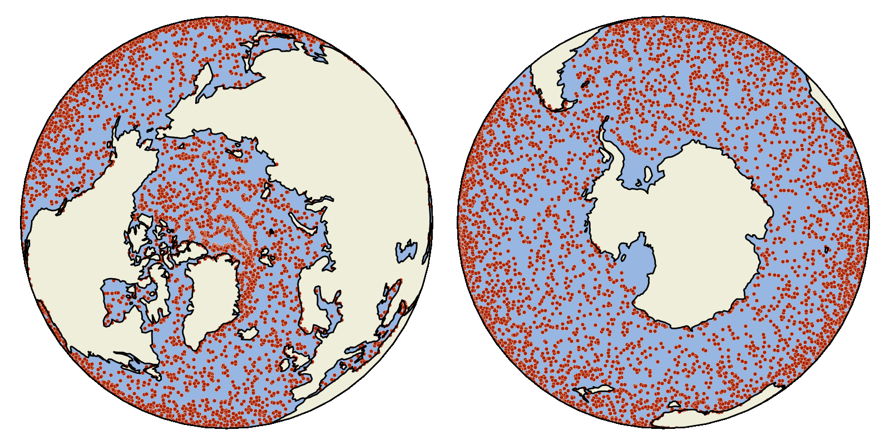

Parcels documentation
===================================

Welcome to the documentation of Parcels. **Parcels** (Probably A Really Computationally Efficient Lagrangian Simulator) is a set of Python classes and methods to create customisable particle tracking simulations using output from Ocean Circulation models. Parcels can be used to track passive and active particulates such as water, plankton, `plastic <http://www.topios.org/>`_ and `fish <https://github.com/Jacketless/IKAMOANA>`_.

*Animation of virtual particles carried by ocean surface flow in the global oceans. The particles are advected with Parcels in data from the* `NEMO Ocean Model <https://www.nemo-ocean.eu/>`_.

Here you'll find `installation instructions <installation.rst>`_, `tutorials and documentation <documentation.rst>`_, and the `API reference <reference.rst>`_ for Parcels. You can browse the documentation for older versions by using the version switcher in the left sidebar.

If you need more help with Parcels, try the `Discussions page on GitHub <https://github.com/OceanParcels/parcels/discussions>`_. If you think you found a bug, file an `Issue on GitHub <https://github.com/OceanParcels/parcels/issues>`_. If you want to help improve Parcels, see the `Contributing <contributing.rst>`_ page.

.. toctree::
   :maxdepth: 2
   :hidden:

   Home <self>
   Installation <installation>
   Tutorials & Documentation <documentation>
   API reference <reference>
   Contributing <contributing>
   OceanParcels website <https://oceanparcels.org/>
