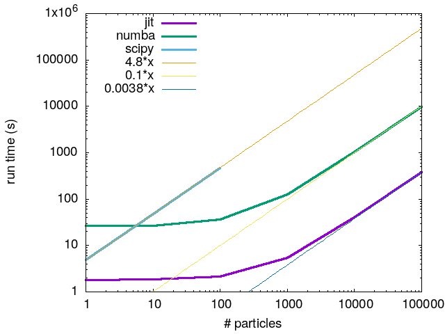

# Numba for Parcels, a report

This is a report for the Numba-Parcels project of the [ITS](https://utrechtuniversity.github.io/research-engineering)-Parcels team. As a summary, we have investigated the feasibility of implementing a parcels version that runs on Numba, instead of JIT/Scipy. In the end we find that at this stage it is most likely possible to technically implement everything in Numba. However, this requires still quite a lot of work to implement all features of parcels. The partial implementation in this branch is unfortunately much slower than JIT, while being less flexible than the scipy implementation, requiring more maintainance. It is significantly faster than scipy though. The main difficulties arise because of Parcels design philosphy of allowing users a lot of leeway in defining types and variables in their simulation. While this of course is one of the main strengths of Parcels as a library, it does pose challenges when working with Numba. The version(s) of Numba that we have used are around `0.54.1`.

## Benchmarks

The benchmark script is located under `parcels/examples/benchmark_stommel.py`, which uses the parcels `stommel` benchmark script `parcels/examples/example_stommel.py`.

The script runs for 600 simulation days with a delta of 1 hour, which amounts to 14,400 simulation steps. This is done for a recent version of the main parcels branch for `scipy` and `JIT` (25 december 2021). The `numba` results are created with this branch. The final positions were validated against the main parcels branch.

The results are summarized in the next figure:

The extra lines are there to compare the performance of the three different lines of code asymptotically. It shows that the Scipy code is about 48 times slower than the numba code, while the JIT/ctypes code is about 26 times faster than the numba code. Thus, the numba code is much faster than the original Scipy code, but JIT is faster still.

## Numba difficulties and limitations

There are some limitations to the `jitclass` implementation, which makes it hard to use for a particle. The main stumble block was we have not found a solution to copying particles within numba. This is necessary for recovery kernels to make a backup of the particle that can be easily rolled back. Manual copying of elements in this case (`dst.x = src.x`) is not possible, since we don't know the attributes `x`. To address this, we have instead chosen the numpy record data structure. This allows for pseudo-object like access, but also allows for copying. One issue though is that other things one could do with particles, such as calling member functions is not possible with these pseudo-particles.

Another point of difficulty that has not been addressed in this branch is the I/O. This is difficult, because the libraries for this (xarray/dask) are not available under numba. Thus, a possible solution will probably need to "exit" and "enter" numba each time data needs to accessed on a disk. It remains a question whether this can be efficient, since the transition does generate some overhead.

Another more general difficulty with Numba, is that it takes quite a bit of time to understand the error messages of Numba. It can be very verbose, and without some experience this can be very difficult to understand what exactly is wrong. On top of that I had a few segmentation faults without any error messages. One was probably because there was not a consistent return value (sometimes an integer, sometimes None). Another one I experienced was when I changed the specifications of a JIT-class. I never figured out what went wrong, so I just redid the work and somehow I haven't experienced the issues again.

`jitclass` is currently still part `numba.experimental`, which means that it can be expected that there are big changes coming, or perhaps even worse is abandoned at some point. Relying the whole code of parcels on this might be quite a risk in terms of maintenance. That is in addition to the fact that numba itself is also not in a very stable state yet. New python version regularly break numba (at least with 3.10), and a lot of development is still happening (which in some ways is a good thing of course). From the issues/pull requests on GitHub it seems most of the development is concentrated on Cuda. While it is hard to judge solely from this what the direction of the project is, it might be another warning sign not to rely on `jitclass` functionality too hard.

A significant limitation is that Numba can only use a very limited set of libraries, mostly numpy. Anything else has to be done outside of `nopython` (JITed) mode. This limitation is of course also applied then to all user kernels.

User kernels in the Numba implementation need to always return some kind of status code. This is necessary, because otherwise Numba segfaults. This obviously is not very nice or informative for the user, and probably we cannot prevent it unless we manually parse the code somehow.

The field access has to always be with the same number of arguments: `field.UV[particle]` is not possible to be implemented, because of how Numba works.

It is relatively difficult to find solutions to issues with numba online, because documentation is sometimes a little sparse, and there is not that many people using `jitclass` that a lot of SO questions exist.

## Implementation details

A general pattern that has been used is that classes such as `Grid` and `Field` are split into two parts: One pure python part, and another that can be compiled into Numba. The advantage/necessity is that type checking for example is not possible in Numba. Thus, these parts can be done in python, while the computation is done in Numba mode. 

Most of the new/modified code is in `parcels.numba`. The code that is present in `parcels.numba.grid` concerns the code for the numba `Grid`. The code has been reorganized and split into separate base classes for z-grid/s-grid and rectilinear/curvilinear. `parcels.numba.field` concerns the Field, Fieldset and VectorField code.

Only the SOA datastructure is modified (because we rely on record arrays, which are similar). Changes are made in `collection.collectionsoa` to reflect this.

There is a limited number of advection kernels that has been modified: `AdvectionRK4`, `AdvectionsRK4_3D` and `AdvectionEE`.

The C/JIT code has been mostly removed, both to remove clutter, but also to ensure that this code doesn't run that part of the code base by mistake.

## First try: NumbaAOS

In the old versions of this branch we worked on a Array of Structures approach to converting parcels to be compatible with numba. This was abandoned, because of the aforementioned issues with copying particles in numba problem.
